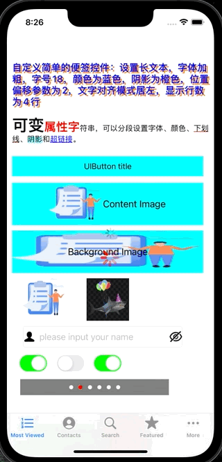

# iOSAppClub
This is a learning Demo of iOS APP development, and I will update the code on a regular basis. 

 

### Demo gif:

 

## [1.【iOS 开发】基础控件：UILabel](https://blog.csdn.net/java_android_man/article/details/122754833)

## [2.【iOS 开发】基础控件：UIButton](https://blog.csdn.net/java_android_man/article/details/122764537)

## [3.【iOS 开发】基础控件：UIImageView](https://blog.csdn.net/java_android_man/article/details/122796669)

## [4.【iOS 开发】基础控件：UITextField](https://blog.csdn.net/java_android_man/article/details/122815355)

## [5.【iOS 开发】基础控件：UISwitch](https://blog.csdn.net/java_android_man/article/details/122832208)

## [6.【iOS 开发】基础控件：UIPageControl](https://blog.csdn.net/java_android_man/article/details/122849444)

## [7.【iOS 开发】基础控件：UISegmentedControl](https://blog.csdn.net/java_android_man/article/details/122900615)

## [8.【iOS 开发】滑块控件 UISlider](https://blog.csdn.net/java_android_man/article/details/122908249)

## [9.【iOS 开发】活动指示器控件 UIActivityIndicatorView](https://blog.csdn.net/java_android_man/article/details/123020482)

## [10.【iOS 开发】进度条控件 UIProgressView](https://blog.csdn.net/java_android_man/article/details/123020870)

## [11.【iOS 开发】步进器控件 UIStepper](https://blog.csdn.net/java_android_man/article/details/123155590)

## [12.【iOS 开发】选择器控件 UIPickerView](https://blog.csdn.net/java_android_man/article/details/123192616)

## [13.【iOS 开发】时间选择器控件 UIDatePicker](https://blog.csdn.net/java_android_man/article/details/123216682)

## [14.【iOS 开发】搜索栏控件 UISearchBar](https://blog.csdn.net/java_android_man/article/details/123241503)

